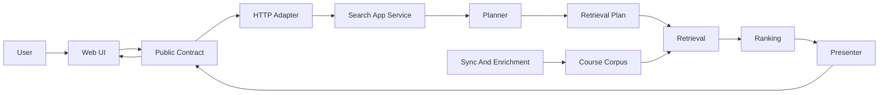

# Search Ownership

This project is greenfield, so compatibility seams should be rare and named.
Search concepts must have one canonical owner, then adapters may translate them
for transport, storage, or display. The recurring failure mode is a concept being
redefined in several layers under slightly different names.

## Ownership Spine

Everything should move through this chain. When a layer reaches sideways to
reinterpret another layer's concept, it creates drift.

## Concrete Owners

- `packages/query-types` owns public request and response DTOs, public query
  codecs, public action DTOs, and display labels or tiers that must match across
  surfaces. It also owns the public GenEd requirement option registry; API and
  web code may consume that registry, but should not define their own GenEd code
  lists.
- `apps/api/src/http` owns transport parsing only. It can call the public codec,
  but it should not own search semantics.
- `SearchPipeline` and related application services own cache, orchestration,
  timings, and calls into planning, retrieval, ranking, and presentation.
- `search-planning-*` owns interpretation of raw student input into an internal
  immutable `SearchPlan`.
- `extraction/*` owns the student-language extraction passes. `extractor.ts` is
  only a facade; pass implementations stay in focused modules and share the
  span-masking helpers in `extraction/text.ts`.
- `search-retrieval-plan*` owns executable lane selection, lane reasons, candidate
  budgets, and planned lane inputs such as filters, sanitized keyword text, alias
  queries, and workload signal types. It must not wrap the full `SearchPlan`.
  Ranking receives internal intent explicitly as a separate `SearchPlan` argument.
- `search-retrieval-lane-executors` owns the registry that turns enabled retrieval
  lanes into executable candidate-recall work.
- `search-retrieval-lanes` is a compatibility barrel. Focused lane modules own
  lane-local candidate recall by source: course text, section text/filters,
  requirements, aliases, workload evidence, and semantic post-filtering.
- `ranking/*` owns fusion, final ordering, ranking components, and ranking policy.
  Component modules should compute named contributions from `RankingPolicy`; they
  should not introduce independent threshold, regex, or score constants that
  change ordering.
- `search-response-presenter` owns translation from internal search artifacts into
  `SearchResponseDto`. `search-debug-response-presenter` owns admin debug response
  assembly so debug routes stay adapter-shaped too.
- `search-ui-plan` composes public UI metadata only. Hint labels, chips,
  ambiguity actions, and interpreted public requests each live in their own
  presenter module. Chip actions receive the executable `meta.nextRequest`;
  display-only interpreted requests must not be used to author executable chip
  continuations.
- `apps/web/src/pages/search` owns UI state and rendering. It consumes public
  requests, public responses, and server-authored `nextRequest` actions. It should
  not know internal planner field names. Its session state has one canonical
  `activeRequest`, replaced only by the server's executable `meta.nextRequest`
  after a successful response. `meta.interpretedRequest` is display/form
  interpretation only; sort, pagination, and refresh must not execute it. Sort,
  pagination, recovery, chip removal, and ambiguity actions execute a
  `SearchRequestDto` directly rather than rebuilding query text and filters from
  derived form state.
- `course-sync-application` and `enrichment-application` own sync and enrichment
  workflows. Routes validate HTTP input and call these services; they do not update
  term state, coordinate GPA/RMP/scoring workflows, or choose embedding wiring.
- `sync-operations` owns shared sync policy helpers such as term status resolution,
  aggregate count reads, embedding flags, and route binding shapes.
- `scripts/lib/*` owns repeated operational script primitives and script domain
  models. Top-level scripts are command adapters, not reusable domain subsystems.
  Term maintenance scripts share Course Explorer term discovery and optional JSON
  input loading through `scripts/lib/term-maintenance.ts`.
- `scripts/workflows/*` owns script-only application workflows that compose CLI
  I/O, script primitives, and explicit API-side parser/transform/writer services.
  This is the named boundary for operational workflows that need app internals.
  Runtime state such as writers, checkpoint stores, fetchers, and counters is
  per invocation, not module-level state.
- `apps/api/src/cisapi/parser.ts` is a compatibility facade. List, detail, XML
  utility, and cascade parsing live in focused parser modules so source-data
  defects do not hide inside one mutable parser file. XML parser call sites use
  structured `htmlparser2` DOM helpers; subject-list parsing, course-list parsing,
  and course-detail parsing should not hand-roll regexes.
- Course-data vocabulary lives in
  `docs/architecture/course-data-vocabulary.md`. Source, storage, product,
  transport, and display names are allowed to differ only at named boundaries.
  Public DTO and internal web state use product vocabulary such as `requirement`,
  `workload`, `catalog`, `scheduleNotes`, `availability`, and `sourceFacts`.
  Student-facing copy for UIUC GenEd requirements says `GenEd`, not the vague
  bare word `Requirement`.

## Naming Rules

- The public search contract concept is `requirement`, not `gened`. Legacy
  `gened` can be accepted as forgiving query syntax only at parser edges.
- The student-facing label for UIUC General Education requirements is `GenEd`.
  Chips, advanced labels, examples, and result evidence should say `GenEd`,
  `GenEd categories`, or `Any GenEd`, while the request/DTO field remains
  `requirement`. Controls should lead with readable category names and may show
  concise public codes such as `US`, `HUM`, or `COMP1` as secondary text.
- Public requirement filters are mode-aware objects: `{ mode: "single" | "any" |
  "all", codes: string[] }`. Courses can satisfy multiple requirements, so
  transport, actions, chips, and pagination must preserve both the mode and the
  full code list instead of collapsing to one string.
- The public search concept is `workload`, not `difficulty`. Stored source columns
  such as `difficulty_score` and `rmp_difficulty` may remain source-shaped, but
  product/request/presentation code should use workload language.
- A course entity, a search result wrapper, and a detail cache envelope are separate
  DTO concepts.
- Course facts are intentionally split: `catalog` contains catalog facts,
  `scheduleNotes` contains Course Explorer schedule notes, and `registration`
  contains registration/approval constraints. Do not put every Course Explorer
  text field back under `registration`.
- Public section DTOs are grouped by `availability`, `schedule`, `instructors`,
  `sourceFacts`, and `links`. Raw Course Explorer status text and codes are
  preserved, but UI status tone and labels flow through section availability
  policy and section display models rather than substring checks in components.
- A `SearchPlan` is internal intent. It is not a public response shape and must not
  leak through `SearchResponseDto`.

## Fitness Checks

These are the checks future changes should preserve or add as automated tests:

- Public search responses do not expose `plan`, `extraction`, `retrievalPlan`,
  `budget`, or `compilerEvents`.
- Routes do not manually assemble search response DTOs. They call the presenter.
- Debug search routes do not manually assemble search internals. They call the
  debug presenter.
- Sync routes do not call low-level sync/enrichment services directly. They call
  `course-sync-application` or `enrichment-application`.
- Retrieval execution flows through `executeRetrievalLanes`; `hybridSearch` does
  not hand-wire one `Promise.all` slot per lane.
- Retrieval plans carry executable lane inputs, not `SearchPlan`. If retrieval
  needs a value, it belongs in `RetrievalPlanInputs`; if ranking needs intent, pass
  the planner artifact to ranking explicitly.
- Retrieval lane implementations stay split by recall source. The
  `search-retrieval-lanes` barrel must not grow new SQL.
- CISAPI list/detail parsers and subject-list consumers use the parser facade and
  DOM helpers, not local XML regexes.
- Fusion consumes a flat `laneResults` stream rather than one DTO property per
  retrieval lane.
- Web search UI options derive values from `packages/query-types`; labels may be
  local presentation.
- Web search follow-up actions derive from session `activeRequest`, which is
  replaced by the server-authored `meta.nextRequest` after a successful response.
- `meta.nextRequest` is a lossless executable continuation request. It is not
  built from `meta.interpretedRequest`. `meta.interpretedRequest` may drop or
  rewrite text for display and advanced-form reset flows only.
- Web sort, pagination, and server-authored refinement actions execute canonical
  `SearchRequestDto` objects, not `{ query, filters }` patches reconstructed from
  derived UI state.
- Advanced search state stores `{ filters, scope }`; `scope` is not a fake filter.
- Advanced GenEd controls consume `GENED_REQUIREMENT_GROUPS` from
  `packages/query-types`; free-text aliases such as `gened`, `cmp`, or source
  prefixed values such as `1US` terminate at parser/codec ingress.
- Public course DTOs and internal web state use requirement vocabulary. Visible
  student-facing GenEd copy uses `GenEd`. Lowercase `gened` names are limited to
  storage/source compatibility and accepted query aliases.
- Public course sections use nested DTO groups and canonical
  `open | restricted | waitlisted | closed | cancelled | unknown` availability.
  UI components do not interpret raw section status strings directly.
- Filtered lane SQL helpers should not carry dormant generic SQL phases such as
  unused `HAVING` support. Add ordered SQL fragments when a real caller needs
  them.
- Invalid explicit URL parameters follow one rule: reject with a clear error.
  Defaults apply only when a parameter is absent.
- Planning passes declare artifacts and the pass harness verifies declared reads
  and writes.
- Student-language lexicons do not import retrieval lane types or map decision
  query types to lanes. Retrieval-facing policy owns that mapping.
- Extraction passes stay split by concern and use the shared extraction pass
  runner plus shared span-masking helpers.
- Public renames, such as `gened -> requirement` or `difficulty -> workload`, must
  update API, web, evals, tests, mocks, scripts, and docs in the same change.
- Script domain libraries must not import API internals. Shared eval-facing types
  that scripts need belong in `packages/query-types`.
- Top-level scripts remain CLI adapters. Large workflows live under
  `scripts/workflows/*`; reusable parsing/resume/report primitives stay under
  `scripts/lib/*`.
- Historical sync workflow state is per run. Do not add module-level writer,
  checkpoint, fetcher, or statistics objects to workflow modules.

## Policy Ownership

- Public display policy lives in `packages/query-types/course-policy.ts`. It owns
  public score normalization and tier labels used across UI surfaces.
- Score production policy lives in `apps/api/src/services/course-score-policy.ts`.
  It owns how source GPA/RMP data becomes normalized quality and workload scores.
- Ranking policy lives in `apps/api/src/services/ranking/ranking-policy.ts`. It
  owns lane weights, ranking component weights, workload filter thresholds, and
  penalties that affect result order.

If a threshold changes, first decide which of those three policies owns it.
