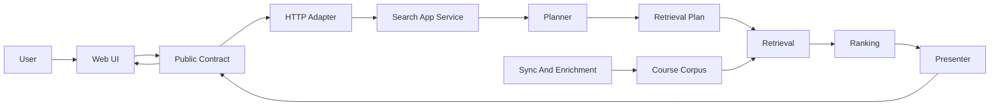

# Search Ownership

This project is greenfield, so compatibility seams should be rare and named.
Search concepts must have one canonical owner, then adapters may translate them
for transport, storage, or display. The recurring failure mode is a concept being
redefined in several layers under slightly different names.

## Ownership Spine

Everything should move through this chain. When a layer reaches sideways to
reinterpret another layer's concept, it creates drift.

## Concrete Owners

- `packages/query-types` owns public request and response DTOs, public query
  codecs, public action DTOs, and display labels or tiers that must match across
  surfaces.
- `apps/api/src/http` owns transport parsing only. It can call the public codec,
  but it should not own search semantics.
- `SearchPipeline` and related application services own cache, orchestration,
  timings, and calls into planning, retrieval, ranking, and presentation.
- `search-planning-*` owns interpretation of raw student input into an internal
  immutable `SearchPlan`.
- `search-retrieval-plan*` owns executable lane selection and candidate budgets.
- `search-retrieval-*` owns candidate recall and evidence from SQL, FTS, Vectorize,
  and structured course data.
- `ranking/*` owns fusion, final ordering, ranking components, and ranking policy.
- `search-response-presenter` owns translation from internal search artifacts into
  `SearchResponseDto`.
- `apps/web/src/pages/search` owns UI state and rendering. It consumes public
  requests, public responses, and server-authored `nextRequest` actions. It should
  not know internal planner field names.
- `scripts/lib/*` owns repeated operational script primitives such as term models,
  CLI argument parsing, and JSON row-shape helpers.

## Naming Rules

- The public search concept is `requirement`, not `gened`. Legacy `gened` can be
  accepted as forgiving query syntax only at parser edges.
- The public search concept is `workload`, not `difficulty`. Stored source columns
  such as `difficulty_score` and `rmp_difficulty` may remain source-shaped, but
  product/request/presentation code should use workload language.
- A course entity, a search result wrapper, and a detail cache envelope are separate
  DTO concepts.
- A `SearchPlan` is internal intent. It is not a public response shape and must not
  leak through `SearchResponseDto`.

## Fitness Checks

These are the checks future changes should preserve or add as automated tests:

- Public search responses do not expose `plan`, `extraction`, `retrievalPlan`,
  `budget`, or `compilerEvents`.
- Routes do not manually assemble search response DTOs. They call the presenter.
- Web search UI options derive values from `packages/query-types`; labels may be
  local presentation.
- Invalid explicit URL parameters follow one rule: reject with a clear error.
  Defaults apply only when a parameter is absent.
- Planning passes declare artifacts and the pass harness verifies declared reads
  and writes.
- Public renames, such as `gened -> requirement` or `difficulty -> workload`, must
  update API, web, evals, tests, mocks, scripts, and docs in the same change.

## Policy Ownership

- Public display policy lives in `packages/query-types/course-policy.ts`. It owns
  public score normalization and tier labels used across UI surfaces.
- Score production policy lives in `apps/api/src/services/course-score-policy.ts`.
  It owns how source GPA/RMP data becomes normalized quality and workload scores.
- Ranking policy lives in `apps/api/src/services/ranking/ranking-policy.ts`. It
  owns lane weights, ranking component weights, workload filter thresholds, and
  penalties that affect result order.

If a threshold changes, first decide which of those three policies owns it.
